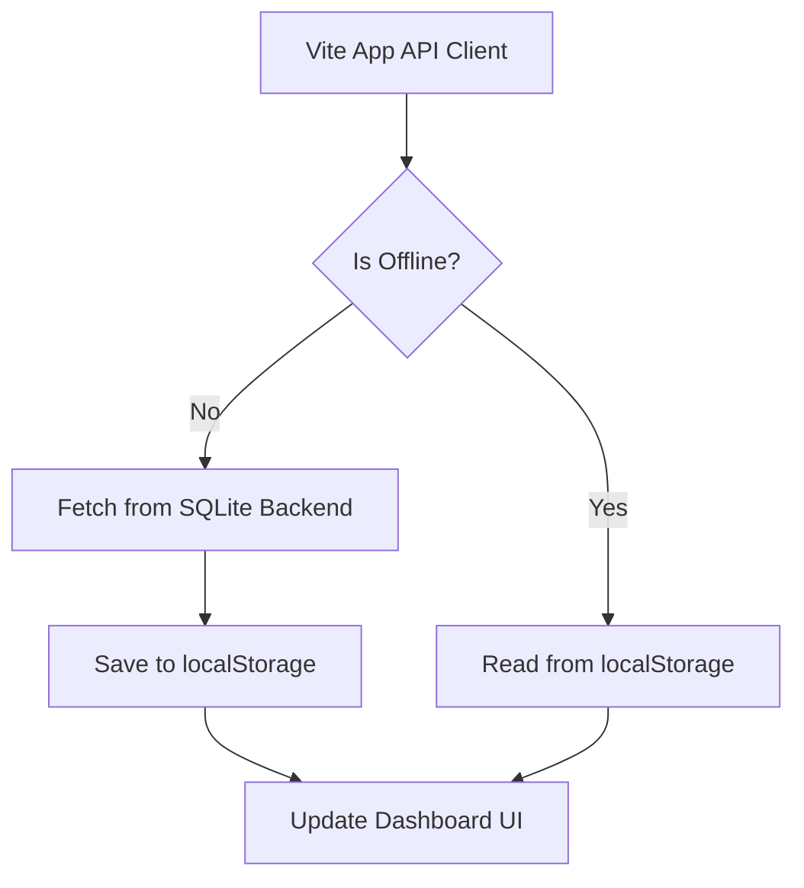

# Mobile Application Architecture & Offline Caching Overview

This document describes the architectural patterns, security systems, and caching strategies implemented in the VelTech Student App to provide high availability on mobile devices under fluctuating campus network coverage.

---

## 1. Offline Caching & Sync Strategy

Campus networks frequently suffer from packet loss or zero-connectivity dead zones (e.g., inside basements or massive seminar halls). The application uses a hybrid offline sync mechanism:

### Static Data Caching
For high-frequency read endpoints that rarely change throughout the semester (e.g., Syllabus, Timetable slots, Exam schedules, and User profile detail cards):
- The app immediately retrieves cached records from `localStorage` upon page load, resulting in instant UI rendering.
- An asynchronous network request is sent in the background. If successful, the local cache is updated and the UI updates dynamically.

### Offline Attendance Queueing
When a student checks in using the QR code scanner while offline:
- The check-in request is captured and queued locally in a `pending_attendance` array in persistent device storage.
- A background worker polls for network connectivity.
- Once connection is restored, the queued check-ins are dispatched to `POST /api/v1/attendance/verify` to ensure attendance credits are logged.

---

## 2. Biometric Authentication Simulator

To protect student credentials and virtual ID cards:
- On native mobile platforms, the application leverages the **Capacitor Face ID/Touch ID Plugin** (`@capacitor-community/face-id`).
- It initiates a secure biometrics prompt on the device.
- **Registration Flow:** If successful, the device generates a local signature key that maps the student's session to their unique biometric signature.
- **Mock Fallback:** When running inside standard web browsers, a cryptographic simulator mocks the device signature verification and updates registration status in the profile database, allowing testing across all devices.

---

## 3. Dynamic Rotating TOTP Security

To prevent visual replay attacks (where a student screenshots their attendance QR code and sends it to a classmate for proxy attendance):
- The attendance QR code is generated using a **Time-based One-Time Password (TOTP)** algorithm.
- The token is recalculated every 15 seconds based on:
  1. The student's unique ID.
  2. The current UNIX epoch time divided into 15-second intervals.
- The backend verifies the check-in by validating that the decrypted token matches the current or immediately preceding time block.

---

## 4. System Preference Cache Synchronization

Theme settings (Light/Dark/Auto) and selected Accent Colors must load instantly to avoid styling flashes:
- Preferences are cached locally in `localStorage` (`theme_preference`, `accent_color`).
- On app initialization (`App.tsx`), these settings are parsed and injected as CSS custom variables before the virtual DOM mounts.
- Whenever a student updates their preferences, they are merged in the backend database via `/api/v1/auth/me/preferences` to persist across device re-installations.
